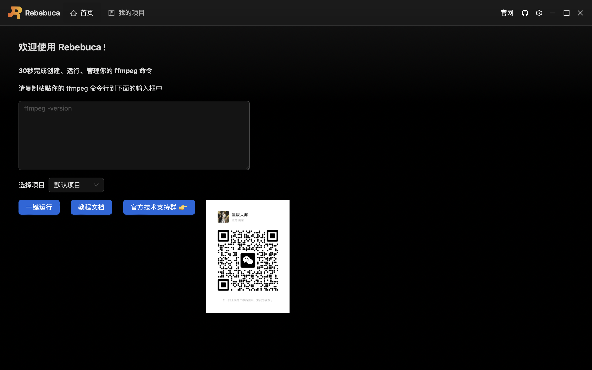

# 快速开始

## 下载安装

- Windows 下载地址：[rebebuca.msi](https://download.m7s.live/rb/Rebebuca_0.2.0_x64_en-US.msi)
- Mac 安装下载地址：[rebebuca.dmg](https://download.m7s.live/rb/Rebebuca_0.2.0_x64.dmg)
- Mac(arm64) 安装下载地址：[rebebuca-arm64.dmg](https://download.m7s.live/rb/Rebebuca_0.2.0_aarch64.dmg)


## 启动软件

下载并安装完成，启动 **Rebebuca** ，会出现下图所示界面：


::: details macOS 系统安装完打开出现 「文件已损坏」解决方案
因为 Rebebuca 没有签名，所以会被 macOS 的安全检查所拦下。安装后打开遇到「文件已损坏」的情况，请按如下方式操作：

步骤1：信任开发者，会要求输入密码:

```bash
sudo spctl --master-disable
```

步骤2：执行下面命令放行 Rebebuca :

```bash
xattr -cr /Applications/Rebebuca.app
```

完成上面两个步骤，大多数情况下都能正常打开 Rebebuca 应用。如果提示以下内容：

```sh
option -r not recognized

usage: xattr [-slz] file [file ...]
       xattr -p [-slz] attr_name file [file ...]
       xattr -w [-sz] attr_name attr_value file [file ...]
       xattr -d [-s] attr_name file [file ...]
       xattr -c [-s] file [file ...]

The first form lists the names of all xattrs on the given file(s).
The second form (-p) prints the value of the xattr attr_name.
The third form (-w) sets the value of the xattr attr_name to attr_value.
The fourth form (-d) deletes the xattr attr_name.
The fifth form (-c) deletes (clears) all xattrs.

options:
  -h: print this help
  -s: act on symbolic links themselves rather than their targets
  -l: print long format (attr_name: attr_value)
  -z: compress or decompress (if compressed) attribute value in zip format
```

则执行命令

```bash
xattr -c /Applications/Rebebuca.app/*
```

如果上述命令依然没有效果，可以尝试下面的命令：

```bash
sudo xattr -d com.apple.quarantine /Applications/Rebebuca.app/
```

通过上面的操作，基本能解决应用打不开的问题，如果还是打不开，请联系 Rebebuca 作者寻求帮助。

:::




## 30秒内创建、运行、管理你的 ffmpeg 命令

观看下方视频：

<video src="/quick.mp4" controls="controls"></video>

